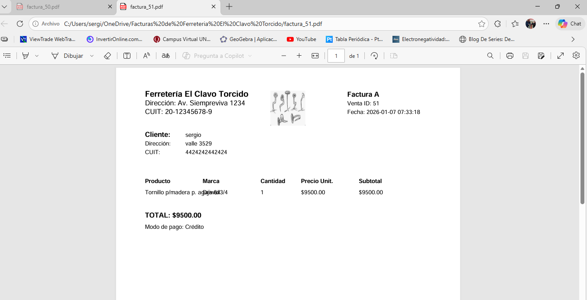
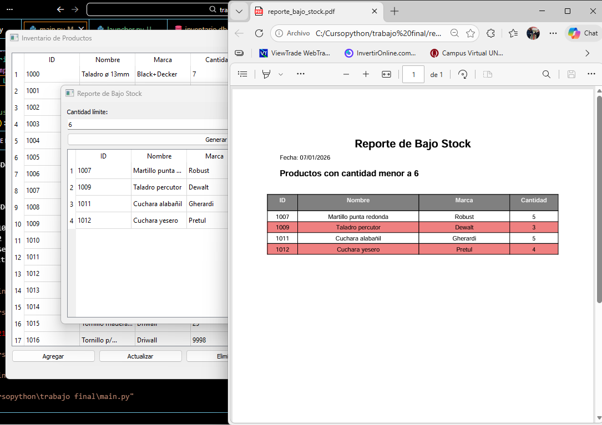

# 📦 Inventario de Productos – Ferretería El Clavo Torcido  
# 🛠️ Sistema de Ventas e Inventario - Ferretería El Clavo Torcido

## 📋 Descripción
Este proyecto es un sistema de gestión para una ferretería, desarrollado en **Python** con **PyQt5** para la interfaz gráfica y **SQLite** como base de datos.  
Permite manejar ventas, clientes, productos e inventario, generando facturas en **PDF** con formato profesional y guardándolas automáticamente en la nube (OneDrive).

## 🚀 Funcionalidades principales
- Gestión de productos e inventario.  
- Registro de clientes con validación de CUIT en formato `XX-XXXXXXXX-X`.  
- Flujo de ventas con carrito y detalle de productos.  
- Generación de facturas en PDF con logo y datos completos.  
- Apertura automática del PDF al emitir la factura.  
- Almacenamiento de facturas en carpeta sincronizada con OneDrive.  
- Base de datos normalizada con tablas: `ventas`, `detalle_ventas`, `productos`, `clientes`, `facturas`.  

## 🗄️ Base de datos
Tablas principales:
- **productos**: catálogo de artículos.  
- **ventas**: encabezado de cada venta.  
- **detalle_ventas**: líneas de productos por venta (incluye `marca`).  
- **clientes**: datos de clientes.  
- **facturas**: registro de facturas emitidas.  

## 🖥️ Tecnologías utilizadas
- Python 3  
- PyQt5  
- SQLite3  
- ReportLab (para generación de PDFs)  
- Pillow (para manejo de imágenes, como el logo)  

## 📂 Organización de archivos
├── main.py                      # Punto de entrada principal ├── launcher.py                 # Lanza la interfaz gráfica ├── productos_backend.py        # Lógica de productos (sin GUI) ├── ventas.py                   # Flujo de ventas y carrito ├── facturacion.py              # Generación de facturas en PDF ├── inventario.db               # Base de datos SQLite ├── ventana_login.py            # Interfaz de login ├── ventana_ventas.py           # Interfaz de ventas ├── ventana_reporte_stock.py    # Interfaz de reporte de stock ├── ventana_agregar_producto.py # Interfaz para agregar productos ├── ventana_actualizar_producto.py # Interfaz para actualizar productos ├── ventana_eliminar_producto.py   # Interfaz para eliminar productos ├── ventana_inventario.py       # Vista general del inventario ├── historial_de_facturas.py    # Consulta de facturas emitidas ├── detalle_venta_facturar.py   # Detalle de productos en cada venta ├── resetventas.py              # Script para reiniciar ventas ├── borrar_tabla_facturas.py    # Script para limpiar facturas ├── requirements.txt            # Dependencias del proyecto ├── README.md                   # Documentación del sistema ├── img_logo/ │   └── logo.png                # Logo de la ferretería ├── Facturas/                   # PDFs generados (sincronizados con OneDrive) └── user.txt                    # Datos de usuarios (versión básica)

## 📸 Capturas de pantalla

A continuación se muestran algunas ventanas del sistema en funcionamiento:

### 🧑‍💻 Inicio de sesión


### 🛒 Ventana de ventas y carrito


### 🧾 Factura generada en PDF


### 📉 Reporte de bajo stock


## Instalación y uso

1. Clonar el repositorio:
```bash
git clone https://github.com/Bigote499/Proyecto-final.git
cd ferreteria

- Crear entorno virtual (opcional pero recomendado):
python -m venv venv
venv\Scripts\activate   # Windows


- Instalar dependencias:
pip install -r requirements.txt


- Ejecutar el sistema:
python launcher.py


Autor
Sergio Sosa
Desarrollador Python especializado en PyQt5, Reportlab y sistema de gestion
GitHub: Bigote499